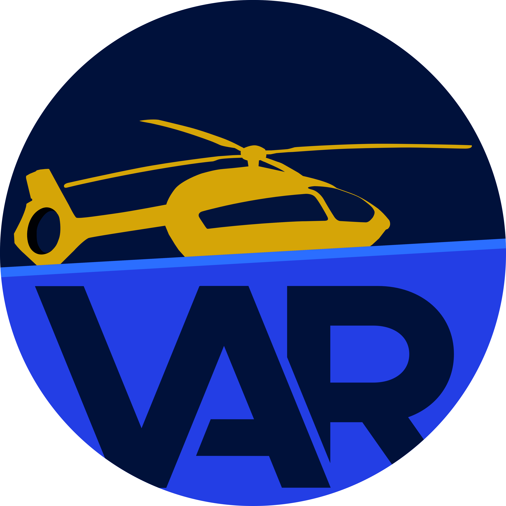
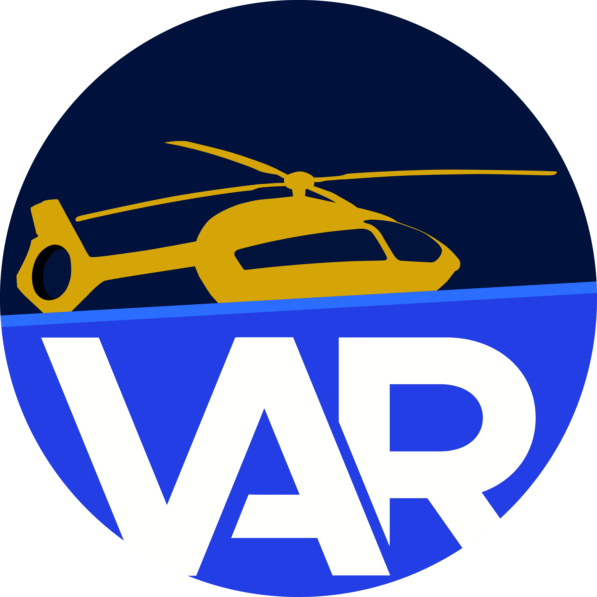
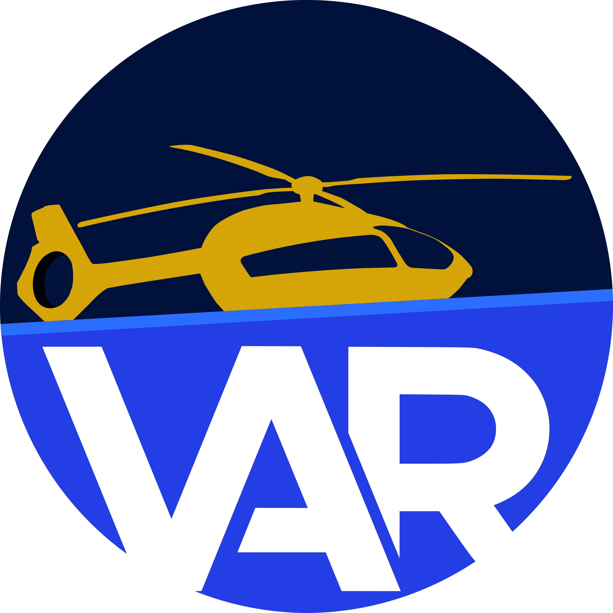

Hier findest du alle Elemente der VAR-Corporate Identity (kurz "CI").

Um einen einheitlichen Auftritt zu gewährleisten bitten wir Dich, dir im Style Guide einen Überblick über die wichtigsten Gestaltungselement, Farben und Verwendungsmöglichkeiten unserer Logos und Schriftzüge zu verschaffen.

Die Benennung der Dateien ist immer einheitlich, sodass sich hinter jedem Namen immer dasselbe Logo verbirgt und sich nur die Dateiendung unterscheidet.

Hier ein Überblick: [tbc]

 

**1_Logo**
Das Logo mit VAR-Schriftzug in STRATOS.

 

**2_Logo**
Das Logo mit VAR-Schriftzug in IVORY.

 

**3_Logo**
Das Logo mit transparentem VAR-Schriftzug.
